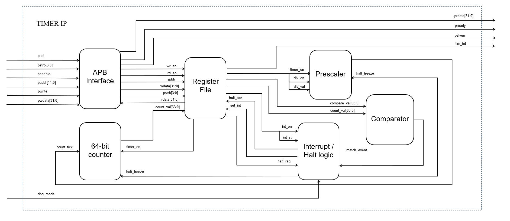

# 64-bit Timer IP Core with APB Interface

## 1. Overview
This repository contains the RTL design and verification environment for a 64-bit Timer IP Core. The design integrates an AMBA APB 32-bit interface and supports frequency scaling, hardware interrupts, and a debug halt mechanism. The IP has been fully verified, achieving 100% Code Coverage via an automated regression setup. 

**Key Features:**
* **Bus Interface:** AMBA APB 32-bit protocol compliant. Supports byte-level access, 1-cycle wait state, and error responses (`pslverr`) for prohibited accesses.
* **Core Logic:** 64-bit count-up timer accessed via two 32-bit data registers (`TDR0`, `TDR1`). Includes a programmable frequency divider (up to 256 via `div_val`).
* **Interrupt Generation:** Hardware, maskable, level-triggered interrupt. Asserts when the 64-bit counter matches the compare registers (`TCMP0`, `TCMP1`).
* **Status Management:** W1C (Write-1-to-Clear) hardware interrupt flags implemented in the TISR register.
* **Debug Mechanism:** Handshake-based Debug Halt (`THCSR` register) to freeze the counter during system debug states.

## 2. Micro-architecture
The IP core is partitioned into four main sub-modules:

<p align="center">
  
</p>

* **`apbif` (APB Interface):** Implements the AMBA APB protocol state machine (`IDLE`, `SETUP`, `ACCESS`). It handles byte-strobe data writes, injects a 1-cycle wait state (`pready`), and generates error responses (`pslverr`) for invalid or unauthorized accesses.
* **`regset` (Register Set):** Implements the memory-mapped register bank. It handles read/write access control, byte-enabling logic, and the Write-1-to-Clear (W1C) mechanism for the interrupt status flags.
* **`cnt_ctrl` (Counter Control):** Contains the clock divider logic to scale the counting frequency (`div_val`). It also manages the hardware handshake (`halt_req` / `halt_ack`) to safely freeze the counter during system debug.
* **`counter` (Core Counter):** A 64-bit synchronous up-counter. It incorporates the 64-bit comparator logic against TCMP0 and TCMP1 to assert the hardware interrupt signal (`tim_int`).

## 3. Register Map
The memory-mapped registers are accessed via the 32-bit APB bus. The base address is defined by the system architecture, and the offset addresses for the Timer IP are listed below:

| Offset | Symbol | Access | Description |
| :--- | :--- | :--- | :--- |
| `0x00` | `TCR` | R/W | **Timer Control Register**: Configures timer enable (`timer_en`), clock divider enable (`div_en`), and divisor value (`div_val`). |
| `0x04` | `TDR0` | R/W | **Timer Data Register 0**: Lower 32 bits of the 64-bit counter. |
| `0x08` | `TDR1` | R/W | **Timer Data Register 1**: Upper 32 bits of the 64-bit counter. |
| `0x0C` | `TCMP0` | R/W | **Timer Compare Register 0**: Lower 32 bits of the 64-bit compare value. |
| `0x10` | `TCMP1` | R/W | **Timer Compare Register 1**: Upper 32 bits of the 64-bit compare value. |
| `0x14` | `TIER` | R/W | **Timer Interrupt Enable Register**: Enables/disables the hardware interrupt output (`int_en`). |
| `0x18` | `TISR` | W1C | **Timer Interrupt Status Register**: Interrupt pending flag (`int_st`). Write 1 to clear the interrupt (W1C). |
| `0x1C` | `THCSR` | R/W | **Timer Halt Control Status Register**: Manages the handshake logic (`halt_req`, `halt_ack`) to freeze the timer in debug mode. |

## 4. Design Verification

The IP Core is verified using a self-checking testbench. The verification environment supports two toolchains:
* **Local Development:** **Icarus Verilog** & **GTKWave** (Automated via Makefile).
* **Coverage:** Siemens EDA **QuestaSim**.

### 4.1. Verification Plan
The verification plan covers 21 test scenarios across 4 main categories, targeting standard operations, corner cases, and APB protocol compliance:

| Feature Category | Verified Scenarios (Key Testcases) |
| :--- | :--- |
| **APB Protocol & Register Access** | - **Basic & Back-to-back:** Single transfers and continuous accesses without bus hangs (`apb_multiple_access`).<br>- **Byte-Strobe:** Partial register updates using `PSTRB` (`byte_access_chk`).<br>- **Register Integrity:** Reset values check, full R/W operations, and One-Hot Data Check (`reg_1hot_chk`) to prevent bit short-circuits.<br>- **Error Handling (`PSLVERR`):** Asserts error for invalid configurations (e.g., writing invalid `div_val` while running). Verifies safe ignoring of unmapped addresses (`error_logic_chk`). |
| **Timer Core Logic** | - **Counting & Overflow:** 64-bit synchronous count-up and wrap-around behavior (`cnt_counting_chk`).<br>- **Prescaler Sweep:** Sweep of valid `div_val` configurations up to div-256 (`cnt_divider_chk`).<br>- **Hardware Clear:** The 64-bit counter is immediately cleared to 0 upon a falling edge of `timer_en` (`cnt_ctrl_chk`). |
| **Hardware Interrupts** | - **Generation:** Asserts `TISR.int_st` when the counter matches `TCMP0/1` without interrupting the count (`interrupt_chk`).<br>- **Masking & W1C:** Masking via `TIER.int_en` and status clearing via Write-1-to-Clear (W1C).<br>- **Priority Logic:** Software Clear (W1C) takes priority over Hardware Set during simultaneous assertion (`interrupt_chk`). |
| **Debug Halt Mechanism** | - **Handshake Protocol:** Assertion of `halt_req` and `halt_ack` during debug mode (`dbg_mode` = 1).<br>- **Freeze & Resume:** Counter freezes at the current value and resumes without skipping division beats (`debug_halt_chk`).<br>- **Halt vs Clear Priority:** Halt mode overrides the hardware clear function if timer_en drops during debug (`debug_halt_chk`). |

### 4.2. Code Coverage 
Code coverage is collected and analyzed using **QuestaSim**, generating the standard Unified Coverage Database (`.ucdb`). The environment achieved 100% Code Coverage across all metrics:
* Line Coverage: 100%
* Toggle Coverage: 100%
* FSM Coverage (State & Transition): 100%
* Expression / Condition Coverage: 100%

**Coverage Exclusion:** `Exclude with Comment` feature is used to waive unreachable defensive logic (e.g., FSM default branches) and unused APB register bits. 

## 5. Synthesis Results
The RTL design was synthesized using **Xilinx Vivado**. The results below reflect the logical area, timing closure, and power estimation post-synthesis.

### 5.1. Resource Utilization
* Slice LUTs: 220 (0.41%)
* Slice Registers (FFs): 149 (0.14%)
* Inputs/Outputs (IO): 89 (71.20%)

### 5.2. Timing Analysis
Timing constraints were met cleanly with zero failing endpoints.
* Target Clock Frequency (`sys_clk`): 100 MHz (Period: 10.000 ns)
* Worst Negative Slack (WNS): +4.915 ns
* Worst Hold Slack (WHS): +0.191 ns
* Failing Endpoints: 0 (Timing is clean)


### 5.3. Power Estimation
Initial vectorless power estimation report:
* Total On-Chip Power: 0.108 W
* Dynamic Power: 0.004 W (4%)
* Device Static Power: 0.104 W (96%)

## 6. How to Run

The simulation environment is automated via a Makefile, supporting both Icarus Verilog for local testing and QuestaSim for coverage collection.

### Prerequisites
* Local Flow: **iverilog**, **gtkwave**, **make**
* Coverage Flow: Siemens EDA **QuestaSim** (`vlib`, `vlog`, `vsim`, `vcover`)

All commands must be executed inside the sim/ directory.
### 6.1. Local Simulation (Icarus Verilog)
* Run the full regression suite (executes all tests in pat.list and prints a PASSED/FAILED summary):
  ```bash
  make regress_iv

* Run a specific testcase and open waveform (GTKWave):
  ```bash
  make all_wave_iv TESTNAME=interrupt_chk

### 6.2 Coverage & Sign-off (QuestaSim)
* Run the full regression to compile, simulate, merge .ucdb databases, apply exclusions (exclude.do), and generate HTML/Text coverage reports:

  ```bash
  make regress_cov
* Run a specific testcase with the QuestaSim GUI enabled for debugging:
  ```bash
  make all_wave_qs TESTNAME=apb_protocol_chk

### 6.3 Workspace Cleanup
Clean generated simulation files, logs, and databases for all flows:
  ```bash
  make clean
